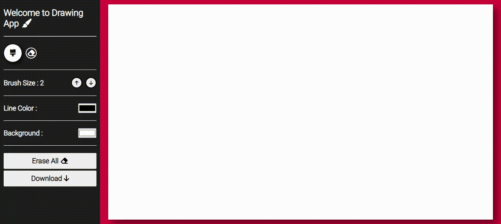

# QuickSketch — Web-based Drawing Application

A simple yet powerful web-based drawing application that lets you create digital art right in your browser. Perfect for quick sketches and creative expressions.

Creator: Dhaval Lalvani

<!-- Badges -->

## Table of contents

- [QuickSketch — Web-based Drawing Application](#quicksketch--web-based-drawing-application)
  - [Table of contents](#table-of-contents)
  - [About](#about)
  - [Features](#features)
  - [Preview](#preview)
  - [How to use locally](#how-to-use-locally)
  - [Files of interest](#files-of-interest)
  - [Credits \& License](#credits--license)

## About

- A feature-rich drawing application built with HTML Canvas
- Intuitive interface for digital sketching and artwork
- Built using pure HTML, CSS, and JavaScript
- Perfect for both beginners and intermediate artists

## Features

- Change pen color with color picker
- Customize background color
- Eraser tool for precise corrections
- One-click canvas clearing
- Download your artwork as an image file

## Preview

The GIF above demonstrates the key features of QuickSketch in action. Try it yourself to experience the full capabilities!

## How to use locally

1. Clone this repository
2. Open `index.html` in your web browser
3. Start drawing!

No additional setup or dependencies required.

## Files of interest

- `index.html` — Core HTML structure
- `style.css` — Visual styling and layout
- `index.js` — Drawing functionality and interactions
- `js-drawing-app-code-output.gif` — Demo preview

## Credits & License

Built with ❤️ by Dhaval Lalvani.

Licensed under the MIT License — see the `LICENSE` file for details.
